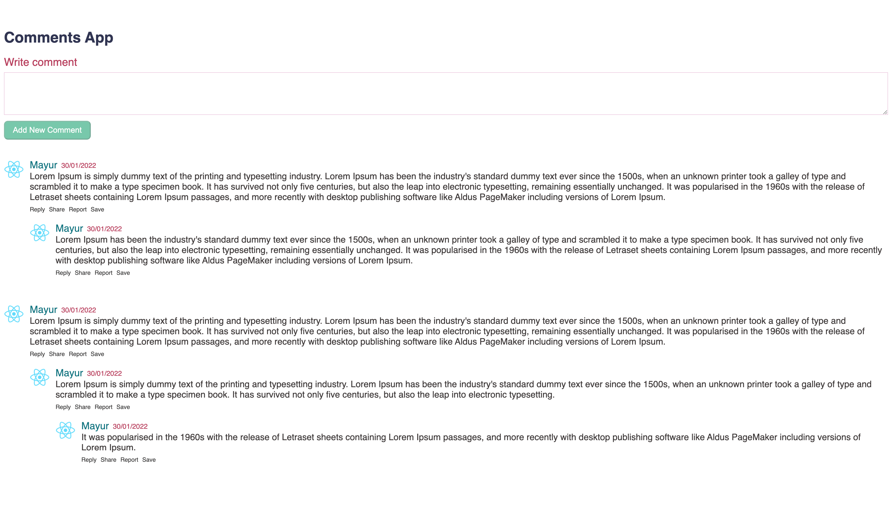

# nested-comment-ReactApp


App is created with Create-React-App
Install the dependencies and devDependencies and start the server.

move to my-app and run npm-start
```sh
cd my-app
npm i
npm-start
```


